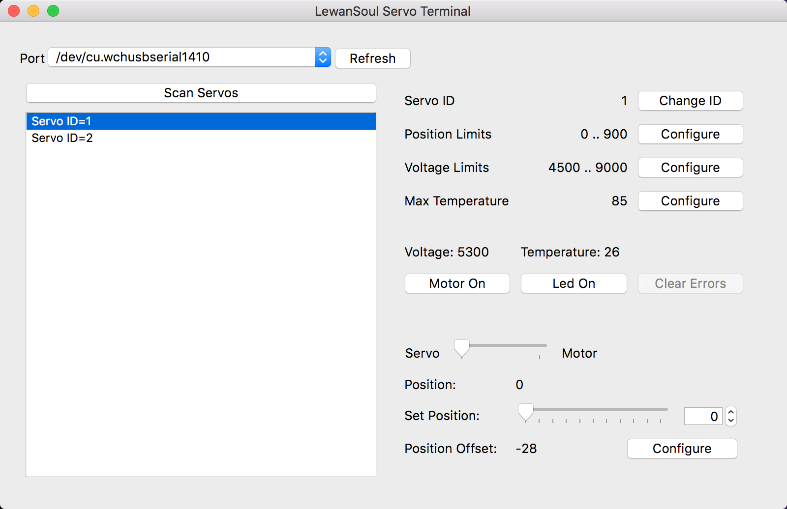

LewanSoul LX-16A servos driver & GUI
====================================

LewanSoul LX-16A is a wonderful servos although using them requires
implementing custom serial protocol and you need to configure them
before use (set unique IDs for all servos, configur limits, etc.).
Company provides a tool for that, but it works only on Windows.

This project aims to fill the gap for non-Windows users. It consists
of two parts: a servo library and a GUI tool. Servo library implements
an interface to talk to servos using their protocol and GUI provides
convenient way to configure them.



Installation
============
Just install both packages to use them:

```
( cd lewansoul-lx16a && python setup.py install )
( cd lewansoul-lx16a-terminal && python setup.py install )
```

To launch GUI use `lewansoul_lx16a_terminal` command.

Code example
============

```python
import serial
import lewansoul_lx16a

SERIAL_PORT = '/dev/tty.wchusbserial1410'

controller = lewansoul_lx16a.ServoController(
    serial.Serial(SERIAL_PORT, 115200, timeout=1),
)

# control servos directly
controller.move(1, 100) # move servo ID=1 to position 100

# or through proxy objects
servo1 = controller.servo(1)
servo2 = controller.servo(2)

servo1.move(100)

# synchronous move of multiple servos
servo1.move_prepare(300)
servo2.move_prepare(600)
controller.move_start()
```

Example of controlling servos through Bus Servo Controller:
```python
import serial
import time
from lewansoul_lx16a_controller import ServoController

logging.basicConfig(level=logging.DEBUG)

s = serial.Serial('/dev/tty.usbserial-00000000', 9600, timeout=2)
c = ServoController(s, timeout=5)

print(c.get_battery_voltage())

servo1_id = 3
servo2_id = 5

print(c.get_positions([servo1_id, servo2_id]))

c.move({servo1_id: 1000, servo2_id: 500}, time=300)
time.sleep(0.3)
c.move({servo1_id: 800, servo2_id: 500}, time=2000)
time.sleep(2)
c.unload([servo1_id, servo2_id])
time.sleep(0.1) # important not to close serial connection immediately
```
